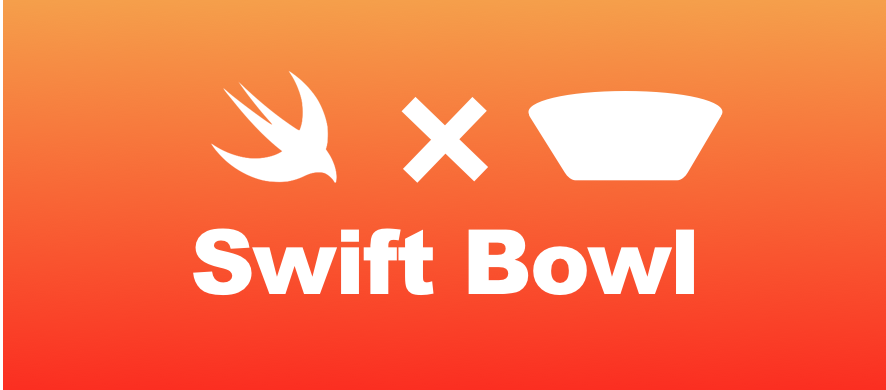
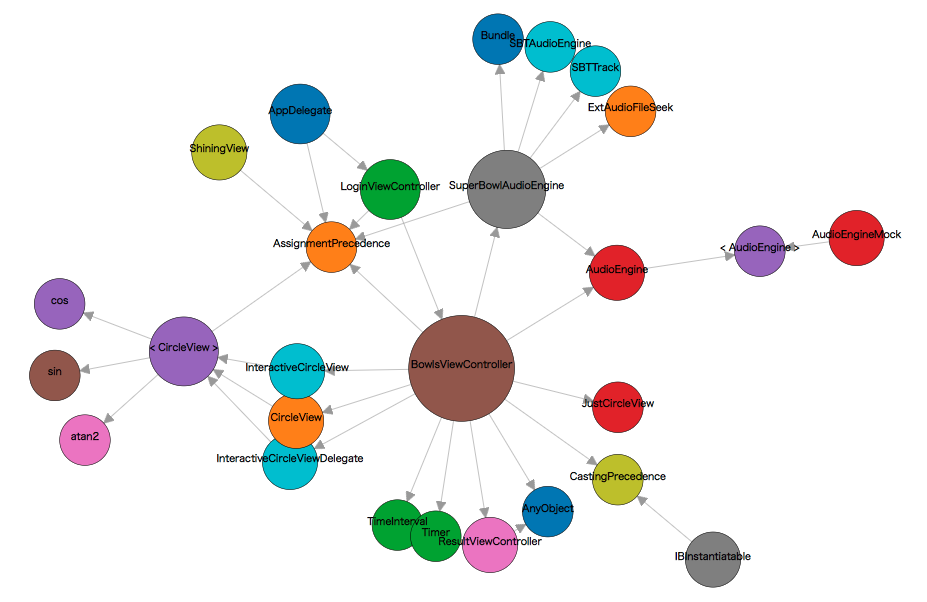
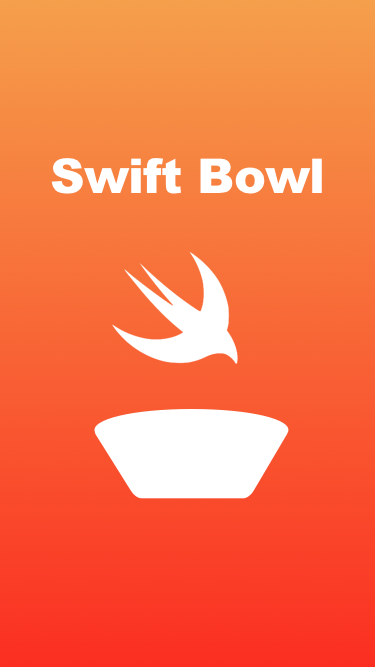
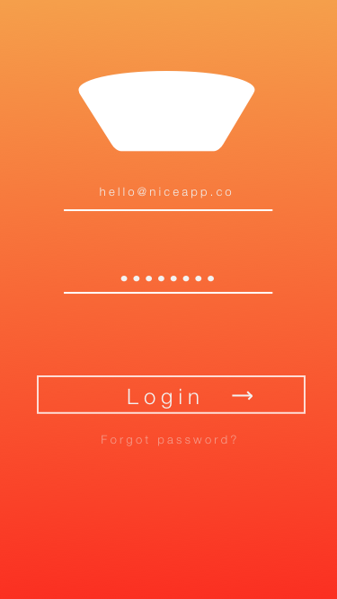
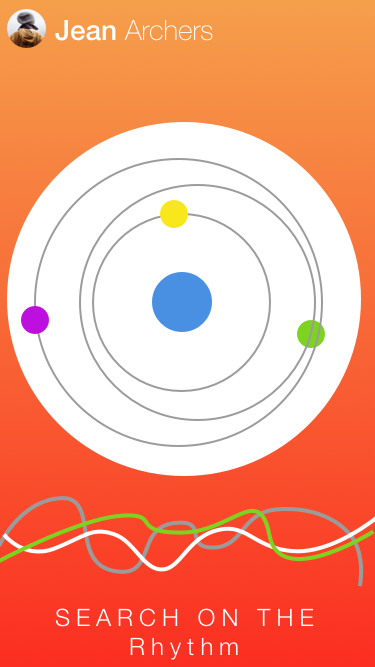
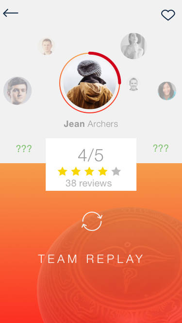

  

# SwiftBowl Document

#### Ideal
- OpenSouceのWelcomeな感じで様々なエンジニアからのPullRequestもらえれば嬉しいね！
- ハッカソンでウケる物を作りましょう
- 我々はハッカーとして作る事を楽しむのであって収益化は基本ない。

#### Team Rule
- PullRequestを送る際はレビューを２人以上でお願いします。

#### Team Plan
- 方針してはとりあえず楽器として完成させる
 - トリガーは真円に近い時と一定の速度である時に高音か低音をだす。[issues](https://github.com/Superbowl-tibet/SwiftBowl/issues/46)
- GitHubとのOAuth認証 (できればいいね)
- CoreAudioの実装
- Class図の作成
- SwiftBowl [overv.io](https://overv.io/Superbowl-tibet/SwiftBowl/) どんどんチケットを書いていきましょう！

#### SwiftBowl Project UML

https://superbowl-tibet.github.io/SwiftBowl.github.io/ObjcUML/index.html

 
# Application Image

